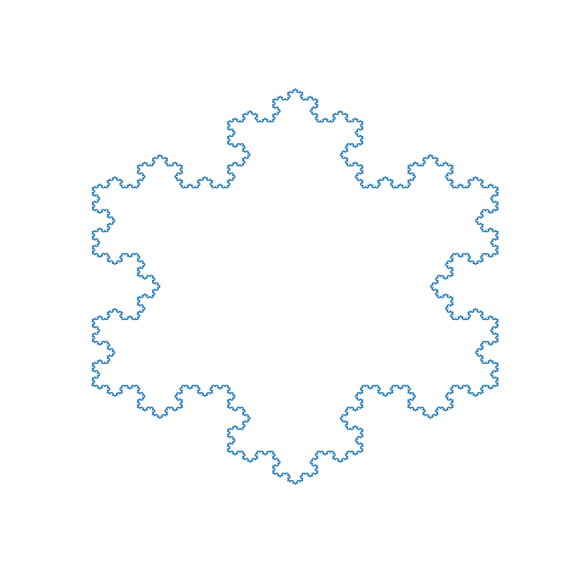

# Koch snowflake

## Usage 

To use simply call the ```koch_snowflake``` function :
```python
koch_snowflake(6)
```

It should display the following : 



To display the antisnowflake, use the arg "anti" :

```python
koch_snowflake(6,anti=True)
```


## TODO
- [x] Implement koch snowflake
- [x] Vectorize the code
- [x] Implement Koch antisnowflake
- [ ] Add zoom possibility / specify region to visualization


## Links 
<https://en.wikipedia.org/wiki/Koch_snowflake>
