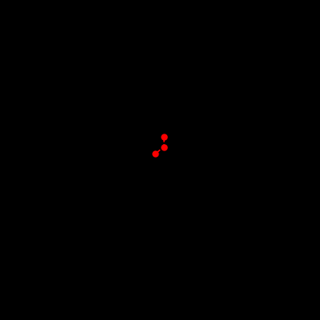

# N Springed Pendulum

**Warning :** for n>2 the computations are really heavy.

## How to use 
```python 
from npendulum import n_pendulum

n_pendulum(n_pendulum=2,filename="2_pendulum.gif",mass=[1,2])
```

You can also directly run the python file n_pendulum.py, it will yield an animation of the 2 springed pendulum with equal mass:




## References

Based on 2-pendulum problem from <https://github.com/lukepolson/youtube_channel/blob/main/Python%20Metaphysics%20Series/vid7.ipynb>