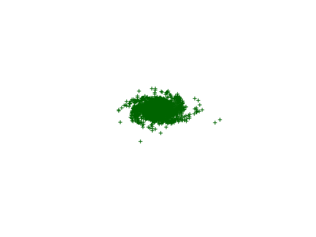

# Galaxy simulation

## Usage
### Generating visuals galaxies
```python3
# Spiral galaxy with 4 arms :
g1 = generate_3Dgalaxy(generate_2Dspiral_galaxy,n_arms=4)

# Elliptical galaxy
g2 = generate_3Dgalaxy(generate_2Delliptical_galaxy)

#plot 
plot_galaxy(g1)
```


## TODO
###  Creation / Visualization
- [x] Generate Spiral galaxy
- [x] Generate Elliptic galaxy
- [x] Generate 3D galaxies

### Simulations
- [x] Implement Vectorized N_Body simulation
- [ ] Find Good Init parameters (velocity, positions , masses) 
- [ ] Single Galaxy simulation (as 3D N body system)
- [ ] Simulate Galaxy merger

## Some refs

* <https://github.com/AGranek/GalaxyCollisionNBody>    
* https://codeboje.de/starfields-and-galaxies-python/    