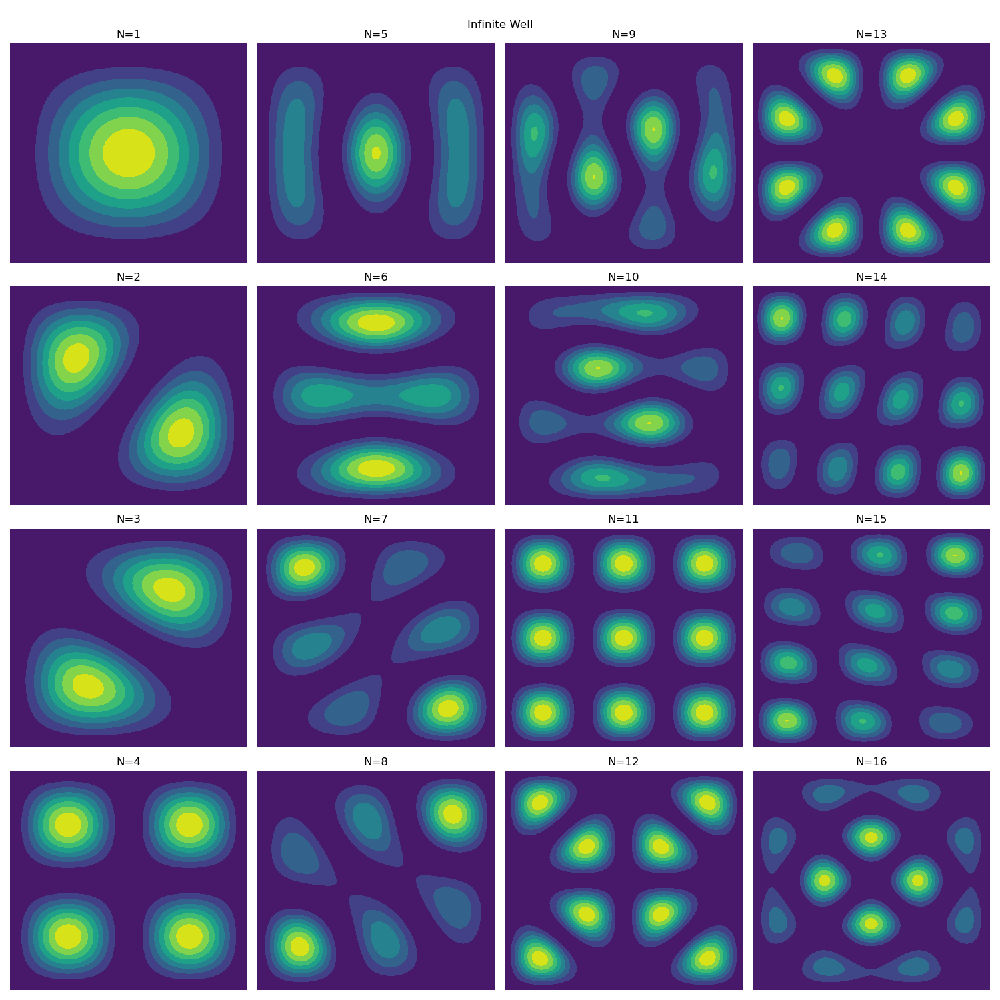

# Eigenstates Solver

## How to use 
```python
# Define your potential
def potential(x,y):
    return x+y

plot_2D_eigenstates(potential)
```

Some potential functions are implemented in the potential.py file.

If you run the eigensovler file you should get the following output : 

 

 

## References

Code originally based on <https://github.com/lukepolson/youtube_channel>